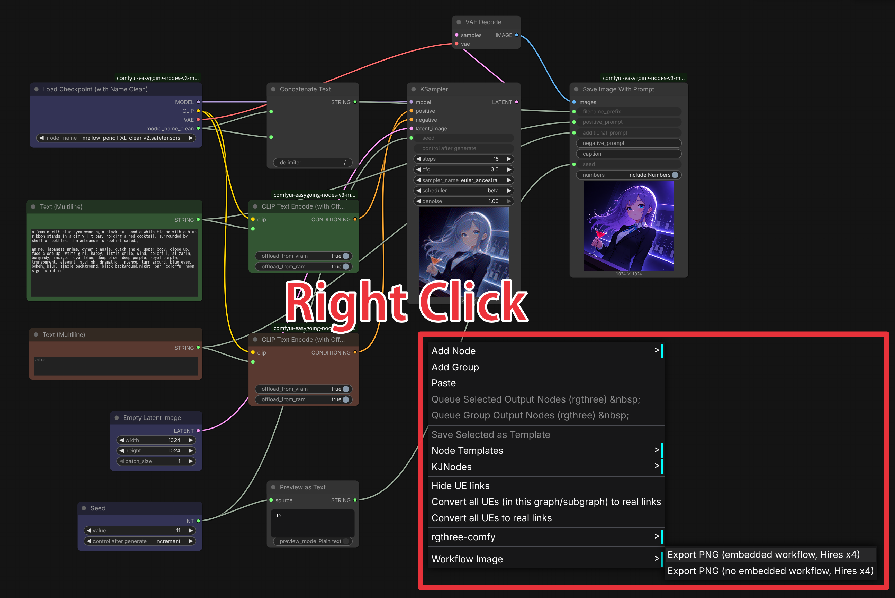
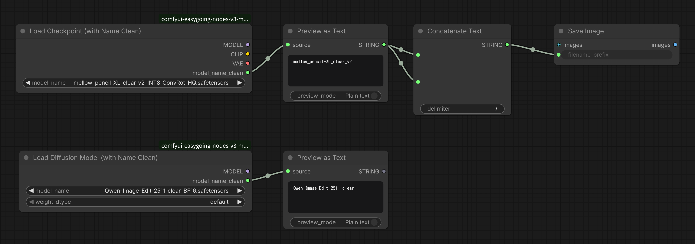
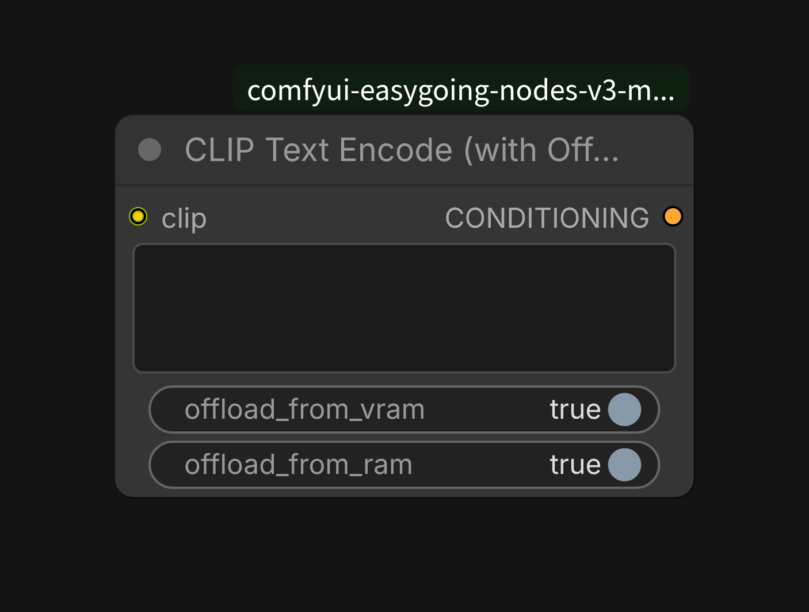
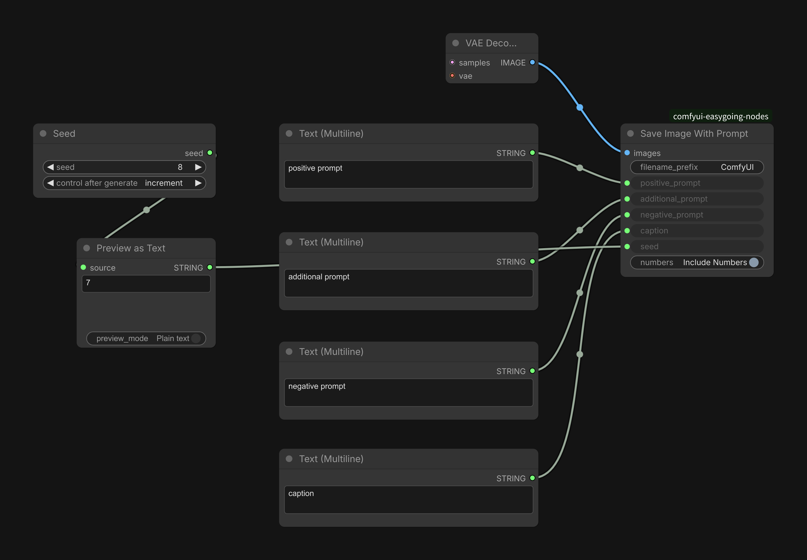
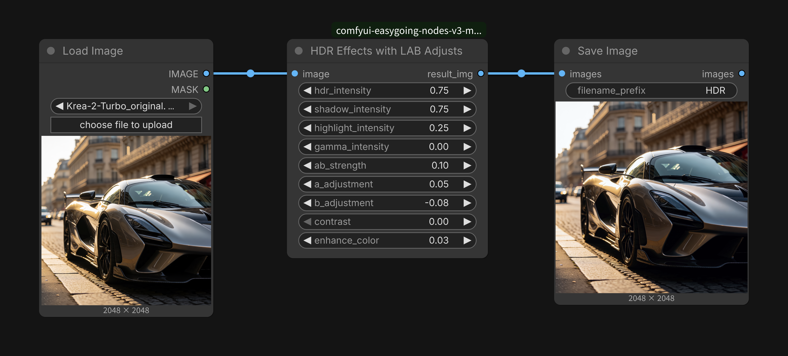
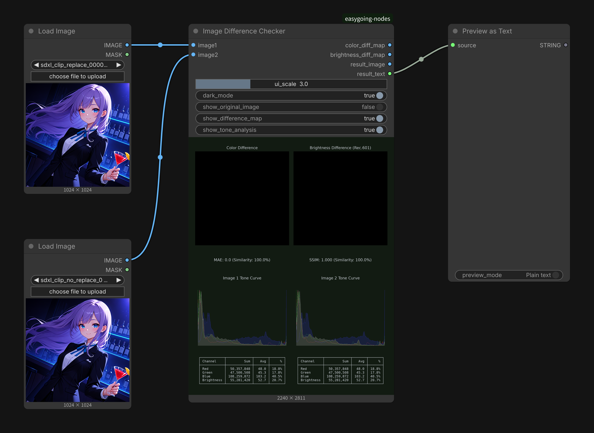
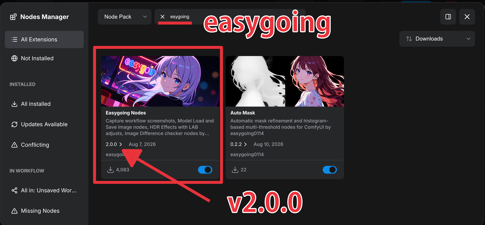

<div align="center">

</div>

# ComfyUI-easygoing-nodes

- Guide (external site): [English](https://www.ai-image-journey.com/2026/08/comfyui-easygoing-nodes-v2.html) | [Japanese](https://note.com/ai_image_journey/n/n7a61e769edab)

Custom nodes for [ComfyUI](https://github.com/comfyanonymous/ComfyUI) focused on practical workflow improvements: workflow screenshots, model loading helpers, prompt metadata embedding, VRAM/RAM control, HDR color adjustment, and image difference analysis.

**v2.0.0** supports ComfyUI **Nodes 2.0** and the **V3 node schema**.

> **Updating from v1.x.x?**  
> Nodes are designed to migrate automatically when opening old workflows. If migration fails in your environment, delete the old nodes and place the new ones again.

---

## Features

### 1. Workflow Screenshots (Nodes 1.0 only)

<div align="center">

</div>

Right-click the canvas → **Workflow Image** → **Export PNG** to save a high-resolution screenshot of the current workflow with embedded metadata.

- Improved implementation based on the original from [ComfyUI-Custom-Scripts](https://github.com/pythongosssss/ComfyUI-Custom-Scripts), fixed for recent ComfyUI frontend changes.
- Exports at **4× resolution** for clean display on high-DPI screens (4K monitors, tablets, etc.).

**Note:** Workflow export is currently supported only in **Nodes 1.0**. Nodes 2.0 (Vue + litegraph rendering) is not supported yet. Switch to Nodes 1.0 when using this feature.

### 2. Improved Model Loading

<div align="center">

</div>

**Load Checkpoint (with Name Clean)** and **Load Diffusion Model (with Name Clean)**

- Lists models from both `models/checkpoints` and `models/diffusion_models`.
- Outputs a cleaned model name (`model_name_clean`) with the following removed (case-insensitive):
  - Precision / format markers: `fp32`, `fp16`, `bf16`, `fp8`, `svd`, `scaled`, `mxfp8`, `nvfp4`, `int8`, `convrot`, `hq`, `e4m3fn`, `e4m3`, `e5m2fn`, `e5m2`
  - Extensions: `.safetensors`, `.pth`, `.pt`
  - Trailing `-` and `_`

Use the cleaned name with a trailing `/` in a Save Image node’s `filename_prefix` to automatically organize outputs into per-model subfolders.

### 3. CLIP Text Encode (with Offload)

<div align="center">

</div>

Replaces the standard CLIP Text Encode node and **explicitly frees** the text encoder from VRAM (and optionally RAM) after encoding.

Useful on systems with limited VRAM/RAM where ComfyUI’s default model retention can reduce available memory. Performance impact depends on your hardware — test both ways.

### 4. Save Image With Prompt

<div align="center">

</div>

Saves images with the following fields stored as **separate PNG metadata** (in addition to the full workflow JSON):

- `positive_prompt`
- `additional_prompt`
- `negative_prompt`
- `caption`
- `seed`

Makes prompts easy to view and copy in image viewers such as [XnView MP](https://www.xnview.com/en/xnview-mp/) or [digiKam](https://www.digikam.org/).

**Tip:** Seeds are integers in ComfyUI. Pass them through a “Preview as Text” (or equivalent) node to convert to string before connecting to this node.

### 5. HDR Effects with LAB Adjust

<div align="center">

</div>

Advanced tone-mapping and color adjustment in LAB color space (luminance and chrominance separated). Controls include shadows, highlights, gamma, contrast, color boost, and per-channel LAB adjustments.

Based on the HDR processing from [ComfyUI-SuperBeasts](https://github.com/SuperBeastsAI/ComfyUI-SuperBeasts) with additional color controls. Well suited for high-contrast looks.

### 6. Image Difference Checker

<div align="center">

</div>

Compares two similar images and outputs:

- Difference map
- Similarity metrics (MAE, SSIM)
- Tone-curve / color analysis

Useful for evaluating VAE reconstruction accuracy, upscaler differences, etc. Use ComfyUI’s partial execution (blue play button) to re-run only from this node onward after changing settings.

### Model Merging

Includes hierarchical model merging nodes (e.g. **Model Scale SDXL**) and related utilities for advanced blending while preserving structure.

---

## Update History

### v2.1.1

- `Image Difference Checker`: Replaced the grayscale difference map with a **Brightness Difference (Rec.601)** map, using Rec.601 luminance weights (0.299R + 0.587G + 0.114B) for consistency with the SSIM calculation.
- Added a Rec.601 brightness curve (gray) drawn on top of the RGB histogram in the tone-curve graph.
- Renamed the `grayscale_diff_map` output to `brightness_diff_map`. **Note:** this will break existing links to that output in saved workflows — reconnect the node after updating.

### v2.1.0

- updated `web/js/workflow_image_export.js` for ComfyUI Nodes Maneger securitu issus.

### v2.0.0

- The experimental `sdxl_clip.py` replacement (enhanced attention mask / tokenization) has been **removed**. Recent ComfyUI core updates made it ineffective.

---

## Installation

### Recommended: ComfyUI Manager / Registry

<div align="center">

</div>

The pack is registered in the [ComfyUI Registry](https://registry.comfy.org/). Search for **Easygoing** in the Nodes Manager and install.

### Manual

```bash
cd ComfyUI/custom_nodes
git clone https://github.com/easygoing0114/ComfyUI-easygoing-nodes.git
```

Restart ComfyUI. Nodes appear under their respective categories (model loaders, image, etc.).
Requirement: A ComfyUI build that supports the V3 node API (`comfy_api.latest`). Older ComfyUI versions without V3 support will not register the nodes.

## Update Notes (v1.8.5 → v2.0.0)

- Full support for Nodes 2.0 and V3 schema.
- Automatic node migration for existing workflows is implemented, but may not succeed in every environment.
- If nodes appear broken or missing after the update, delete the old instances and re-add the new ones.
- Updating ComfyUI itself is also recommended if you encounter issues.

---

## Links

- Guide v2.0.0 (External site): [English](https://www.ai-image-journey.com/2026/08/comfyui-easygoing-nodes-v2.html) | [Japanese](https://note.com/ai_image_journey/n/n7a61e769edab)
- Guide v1.0.0 (External site): [English](https://www.ai-image-journey.com/2025/09/comfyui-easygoing-nodes.html) | [Japanese](https://note.com/ai_image_journey/n/n5bb33311b866)

---

## Credits

- HDR Effects based on [ComfyUI-SuperBeasts](https://github.com/SuperBeastsAI/ComfyUI-SuperBeasts)
- Workflow screenshot improvements based on [ComfyUI-Custom-Scripts](https://github.com/pythongosssss/ComfyUI-Custom-Scripts)

---

## License

[MIT License](LICENSE)

---
